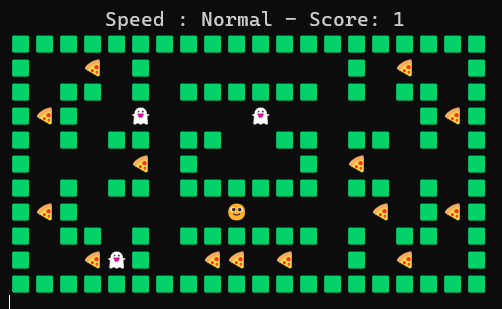

<h1 align="center">Pacman</h1>  

    

 

## Table of Contents

- [Demo](#demo)
- [Introduction](#introduction)
- [Technologies](#technologies)
- [Features](#features)
- [Contributors](#contributors)

 

## Demo

 

    

 

## Introduction
This is a python console game which is basic pacman games. Console refresh itself in every time to display locations to player as animated.

 

## Technologies

* Python

 

## Features

* Speed can be changed.
* Score is displayed.
* Has interfaces for start and end screen.
* Foods generated automatically.

 

## Contributors

